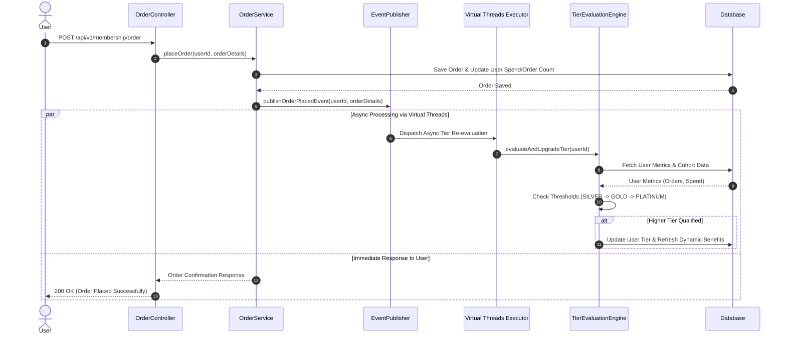
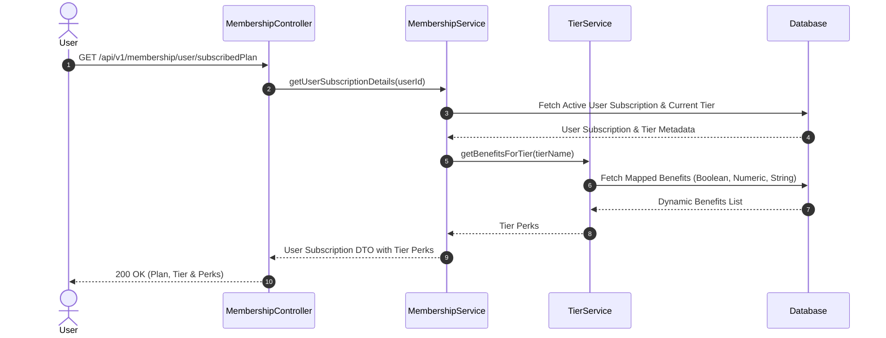

# Membership Program Backend Service

A robust, enterprise-ready Spring Boot microservice designed for managing subscription-based memberships with dynamic tier progression, flexible benefit mapping, automated order-driven tier evaluations, and OAuth2 JWT security.

---

## 📌 Project Overview

This backend system powers the membership ecosystem for an e-commerce platform. Users can subscribe to various plans (`MONTHLY`, `QUARTERLY`, `YEARLY`), earn dynamic perks based on their active membership tier (`SILVER`, `GOLD`, `PLATINUM`), and automatically unlock higher tier levels as they place orders or meet specific activity criteria.

---

## ✨ Features

* **Flexible Subscriptions**: Comprehensive management of user subscriptions across standard billing cycles (`MONTHLY`, `QUARTERLY`, `YEARLY`).
* **Dynamic Tier Evaluation Engine**: Strategy-pattern-driven evaluation logic that automatically checks user order count, monthly spend thresholds, and cohort assignments to upgrade user tiers seamlessly.
* **Configurable Dynamic Benefits**: Multi-type benefit management (`BOOLEAN`, `NUMERIC`, `STRING`) allowing admins to link, update, or unlink tier benefits on the fly without system downtime.
* **Asynchronous Event Architecture**: Non-blocking order event publication using Java Virtual Threads (`Executors.newVirtualThreadPerTaskExecutor()`) to perform tier re-evaluation in the background.
* **Global Error Handling**: Centralized exception handling across all endpoints producing standardized, time-stamped JSON error responses.
* **Role-Based Access Control (RBAC)**: Stateless Spring Security 6 integration as an OAuth2 Resource Server with JWT claim converter mapping roles (`ROLE_USER`, `ROLE_ADMIN`).
* **OpenAPI 3.0 & Swagger UI**: Full interactive API documentation and testing interface out of the box.

---

## 🛠️ Tech Stack & Dependencies

* **Java Version**: Java 21+
* **Framework**: Spring Boot 3.x (Spring Web, Spring Data JPA, Spring Security)
* **Database**: In-Memory H2 Database (local development profile) / JPA Hibernate
* **Concurrency**: Java Virtual Threads
* **Security**: OAuth2 Resource Server with JWT authentication
* **API Documentation**: SpringDoc OpenAPI UI / Swagger

---

## 🚀 Getting Started

### Prerequisites

* **JDK 21** or later
* **Maven 3.8+**

### Running the Application

1. **Clone the repository:**
```bash
git clone <repository-url>
cd membershipProgram

```


2. **Build and run locally using the `local` profile:**
```bash
mvn spring-boot:run -Dspring-boot.run.profiles=local

```


3. **Access Interactive Endpoints:**
* **Swagger UI**: [http://localhost:8080/swagger-ui.html](https://www.google.com/search?q=http://localhost:8080/swagger-ui.html&utm_source=gemini)
* **OpenAPI JSON**: [http://localhost:8080/v3/api-docs](https://www.google.com/search?q=http://localhost:8080/v3/api-docs&utm_source=gemini)
* **H2 Console**: [http://localhost:8080/h2-console](https://www.google.com/search?q=http://localhost:8080/h2-console&utm_source=gemini)
* **JDBC URL**: `jdbc:h2:mem:testdb`
* **Username**: `sa`
* **Password**: *(leave blank)*


---

## 📑 API Reference Summary

### 1. Registration (`Public`)

| Method | Endpoint | Description |
| --- | --- | --- |
| `POST` | `/api/register/user` | Register a new standard user account (`ROLE_USER`) |
| `POST` | `/api/register/admin` | Register a new administrative user account (`ROLE_ADMIN`) |

### 2. User Operations (`ROLE_USER`)

| Method | Endpoint | Description |
| --- | --- | --- |
| `GET` | `/api/v1/membership/plans-and-tiers` | View all available membership plans and tier benefit structures |
| `GET` | `/api/v1/membership/user/subscribedPlan` | Fetch current user subscription details, tier rank, and assigned benefits |
| `POST` | `/api/v1/membership/subscribe` | Subscribe to a plan (`MONTHLY`, `QUARTERLY`, `YEARLY`) |
| `PUT` | `/api/v1/membership/subscription` | Upgrade or downgrade an existing active membership plan |
| `POST` | `/api/v1/membership/subscription/cancel` | Cancel active membership subscription |
| `POST` | `/api/v1/membership/order` | Place an order and trigger async background tier qualification checks |

### 3. Admin Operations (`ROLE_ADMIN`)

| Method | Endpoint | Description |
| --- | --- | --- |
| `POST` | `/api/v1/membership/admin/plans` | Create a new membership plan |
| `PUT` | `/api/v1/membership/admin/plans/{id}` | Update existing plan details |
| `DELETE` | `/api/v1/membership/admin/plans/{id}` | Delete a membership plan |
| `POST` | `/api/v1/membership/admin/benefits` | Define a new benefit definition (e.g., `FREE_DELIVERY`, `EXTRA_DISCOUNT_PERCENTAGE`) |
| `POST` | `/api/v1/membership/admin/benefits/tag` | Link or update a benefit value for a specific tier |
| `GET` | `/api/v1/membership/admin/benefits/{tierName}` | List all benefits mapped to a target tier |
| `DELETE` | `/api/v1/membership/admin/benefits/{tierName}/{benefitId}` | Unlink a benefit mapping from a tier |

---

## ⚠️ Exception Handling & Error Architecture

The application uses a centralized `@RestControllerAdvice` (`GlobalExceptionHandler`) to intercept custom domain exceptions and framework-level errors, transforming them into a unified `ErrorResponse` model.

### Error Response Schema

```json
{
  "status": 404,
  "error": "Not Found",
  "message": "Resource with specified identifier was not found",
  "timestamp": "2026-09-21T01:08:50Z"
}

```

### Handled Exceptions Mapping

| Exception | HTTP Status | Description |
| --- | --- | --- |
| `ResourceNotFoundException` | `404 NOT FOUND` | Thrown when a requested entity (User, Plan, Tier, Benefit) does not exist |
| `InvalidRequestException` / `IllegalArgumentException` | `400 BAD REQUEST` | Thrown when business rules validation fails or invalid arguments are passed |
| `MethodArgumentNotValidException` | `400 BAD REQUEST` | Captures standard DTO `@Valid` validation errors and returns field details |
| `IllegalStateException` | `409 CONFLICT` | Thrown on invalid state transitions (e.g., subscribing to an active plan) |
| `AccessDeniedException` | `403 FORBIDDEN` | Thrown by Spring Security when role permissions (`ROLE_ADMIN`) are missing |
| `Exception` | `500 INTERNAL SERVER ERROR` | Fallback handler for unhandled runtime exceptions |

---

## 📐 Sequence Diagrams

### 1. Order Processing & Async Tier Auto-Upgrade Workflow



### 2. User Membership Management & Query Workflow



---

## 📸 Screenshots

### Subscribed Plan for a User after Auto-Upgrade to Dynamic Tier Level

---

## 🔮 Roadmap & Future Enhancements

### External Notification Microservice (TO DO)

A separate microservice will handle asynchronous user communications via event streaming (Kafka/RabbitMQ):

1. **Admin Modification Alerts**: Notify active subscribers immediately whenever an `ADMIN` updates or deletes a plan or tier benefit structure.
2. **Pre-Expiry Reminders**: Automatically dispatch reminder notifications to users **7 days prior** to their subscription expiration date.
3. **Expiration & Renewal Notifications**: Send immediate alerts when a membership expires, providing direct call-to-action links to renew or upgrade.